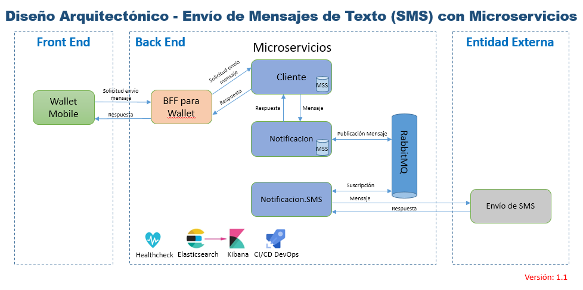

# Prueba de Concepto: Microservicios para Billetera Virtual (Wallet)

## Descripción
Esta PoC - Prueba de Concepto muestra de manera simplificada, los distintos tipos de componentes involucrados en la adopci&oacute;n de una arquitectura de Microservicios. 
El diseño arquitectonico a continuación, ilustra la soluci&oacute;n end-to-end presentada para la PoC, que satisface el modelo IaaS - Infrastructure as a Service/Infraestructura como Servicio:

## Detalle

-   Desde el Front End, se solicita el env&iacute;o de un mensaje de tipo SMS - Short Message Service/Servicio de Mensajes Cortos/Simples 
-   A trav&eacute;s del Back End for Front End, se accede a la capa de Microservicios para env&iacute;o del mensaje
-   El Microservicio de Clientes recibe la solicitud y la canaliza hacia la plataforma de Microservicios de Notificaciones
-   El Microservicio encargado de env&iacute;o de Notificaciones lo publica en la cola de eventos de RabbitMQ
-   Un Microservicio de Notificaciones por SMS suscripto a la cola de eventos, recibe el mensaje y lo env&iacute;a la entidad externa, 
    que es la responsable del env&iacute;o concreto del SMS.

# Componentes de la PoC, Demo

La Solucion para la PoC, esta diseñada para emular un envio de mensaje a traves de SMS, funcionalidad muy comun en procesos de Onboarding de Clientes 
para validaci&oacute;n del n&uacute;mero de tel&eacute;fono celular y control de fraude, entre otros.
A continuaci&oacute;n, la lista de componentes involucrados:

### Front End
Para el Front End, se utiliza la especificacion OpenAPI de documentación y utilización de servicios Web RESTful, tambien conocida como Swagger.

## Back End
En el Back End encontramos un conjunto de Microservicios con los siguientes patrones:
- Patr&oacute;n de diseño BFF-Backend for Frontend, permitiendo considerar que el acceso a nuestros microservicios se realizan desde clientes especificos  y con necesidades especificas, eliminando acoplamiento entre clientes diferentes
con casos de uso particulares.
- Patr&oacute;nes de diseño para los microservicios de negocio, tales como Descomposición, Integración, Base de datos por servicio, Observabilidad 
e Inyección de Dependencias, obteniendo alta cohesión y bajo acoplamiento.

Se destacan las implementaciones de Elasticsearch+Kibana, como motor de busqueda de texto y visualización de datos, Health Checks para validar el estado  de los microservicios y sus dependencias;
todo bajo buenas pr&aacute;cticas de DevOps.

## Entidad externa
En la Entidad Externa se encuentra el proveedor de servicios para env&iacute;o de SMS, que cumple con esa responsabilidad.

